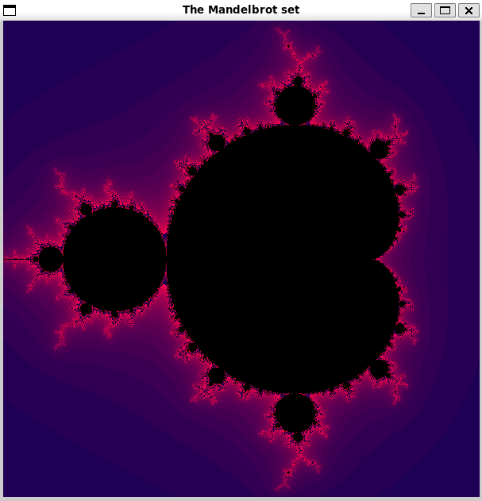

# Mandelbrot

## Review
Mandelbrot is a program for visualization of the Mandelbrot set and measuring the speed of calculating points in various ways (simple calculating, array handling and using SIMD)



---

## Compilation

Makefile uses g++ so make sure you have it installed.

To create .out file, write to the terminal from "Mandelbrot" folder:

```bash
    make
```

Now you have a file **mandelbrot.out**. The program can be run with different arguments depending on your needs:

1. **First argument - mode:** the program supports 2 modes - graphics for visualization (`--graphics`) and calculation for measuring FPS (`--calculation`)

2. **Second argument - method:** the points can be calculated in 3 ways - simple calculating (`--simple`), array handling(`--array`), and calculating using SIMD (`--simd`)

**E.g.** If you want to visualize the Mandelbrot set using SIMD for calculations:

```bash
    ./mandelbrot.out --graphics --simd
```

## Graphics navigation

You can move and zoom the image to take a closer look at specific areas:

Key     |Action
:------:|:-------
↑       | Up
↓       | Down
←       | Left
→       | Right
Z       | Zoom in
X       | Zoom out
Esc     | Reset

## Measurement results

Mode | Simple | Simple (-O3) | Array | SIMD  |
-----|--------|--------------|-------|-------|
**FPS**  | 6.17   | 13.95        | 17.67 | 27.30 |
